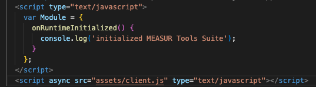

# MEASUR Tools Suite  

## Update (08/25/2025)

The MEASUR Tools Suite is currently undergoing a major update to improve usability and maintainability. This includes a refactoring of the codebase to follow consistent practices, better organization, and enhanced documentation around the engineering aspects of the calculations. To follow the progress of this update, please refer to the [Roadmap](ROADMAP.md). As the codebase is refactored, some Emscripten bindings will change. A summary of these changes can be found in the [Emscripten Bindings Changes](EMSCRIPTEN_BINDINGS_CHANGES.md) document.

## About

The MEASUR Tools Suite is a collection of industrial efficiency calculations written in C++ and with bindings for compilation to WebAssembly. The tool suite web assembly module is used for calculations with the MEASUR application.

For more information about the MEASUR ecosystem visit [https://industrialresources.ornl.gov/measur](https://industrialresources.ornl.gov/measur)

Hosted documentation can be found at [https://industrialresources.ornl.gov/measur/suite/docs](https://industrialresources.ornl.gov/measur/suite/docs)

The npm packages can be downloaded and install from [registry](https://www.npmjs.com/package/measur-tools-suite)

### Dependencies

#### C++

- make
- CMake (cmake-curses to use the ccmake gui)
- GCC 4.8.5 or later
  - Windows: MinGW or Cygwin or Visual Studio Build Tools or with other C++ compiler
- Doxygen (only for building documentation)

#### Web Assembly Compilation SDK

- Emscripten (emsdk) - Follow instructions for install https://emscripten.org/docs/getting_started/downloads.html
- From the emsdk directory run `./emsdk install latest`
- Then run `./emsdk activate latest`
- Then run `source ./emsdk_env.sh` to set the environment variables in the current terminal session.
  - On Windows use `emsdk_env.bat`

> [!NOTE]
> This needs to be done each time a new terminal session is started, or add the command to your shell profile script (e.g. .bashrc, .zshrc, etc.)

#### Node
- Node LTS [https://nodejs.org/en/](https://nodejs.org/en/) 

### Build Web Assembly Module

- Ensure you have followed the "Install and Activate Emscripten" steps above
- From the root directory of the MEASUR Tools Suite repository run `emcmake cmake -DBUILD_WASM=ON`
  > If multiple compilers are present and default environment is not used, use `-G "<XXX> Makefiles"`. For example, on Windows using MinGW: `emcmake cmake -D BUILD_WASM=ON .. -G "MinGW Makefiles"`
- Then run `emmake make`
  > This will create the build artifacts `client.js` and `client.wasm` in the `/bin` directory. `client.js` is the glue code for initializing the WASM module. Place the two files in the same directory within your project and execute the `client.js` script.

### WASM Initialization Example

MEASUR Tools Suite is distributed as a modularized WebAssembly Module. 
Below is an illustration of the WASM initialization and usage process:

### WASM Unit Tests

- Ensure you have followed the "Build WebAssembly Module" steps above
- From the root directory of the MEASUR Tools Suite repository run `npm install` to install node dependencies
- Then run `npm run test:browser`
  > All mocha tests found under `tests/wasm-mocha/` will be executed. 
  > Migration of unit tests to the mocha framework is a WIP.

### C++ Unit Tests

- Ensure the `BUILD_TESTING` flag is set (which is default) when running CMake
- From the root directory of the MEASUR Tools Suite repository, run `mkdir build-cpp` and `cd build-cpp`
- Then run `cmake ..`  
  > If multiple compilers are present and default environment is not used, use `-G "XXX Makefiles"`. For example for windows using MinGW => `cmake .. -G "MinGW Makefiles"`
- Then run `cmake --build .`
- Then run `cd bin` and `./cpp_tests` to execute the tests
  > On Windows, the executable can be found under either the `Debug` or `Release` directories, depending on CMake configuration

### Packaging

- Enable the `BUILD_PACKAGE` flag in the CMakeCache, then `cmake ./` then `make package`
- Or use this directly for Windows: `cmake -D BUILD_TESTING:BOOL=OFF ./` and `cmake --build . --config Release --target PACKAGE`
- To make package on Linux or Mac, run `ccmake.` and set BUILD_TESTING OFF, BUILD_PACKAGE ON, then configure and generate. Then `make package`.

### Generate Documentation Locally

- Ensure Doxygen (v 1.14.0 or later) is installed
- From the root directory of the MEASUR Tools Suite repository run `doxygen Doxyfile`
  > The documentation will be generated in the `/docs/html` directory

### Dockerizing 

To make it easy for developers local building and testing, it is dockerized. To run it in docker follow these steps.

- Download the repository
- Open command line tool, change directory to the repository run `docker compose up -d`
- To stop the running container run `docker compose down`
- Running Unit Tests
  - WASM: in a browser, launch [http://localhost:3000/](http://localhost:3000/)
  - C++: run `docker exec -it measur-tools-suite-build /bin/bash` and run the executable `/home/MEASUR-Tools-Suite/build-cpp/cpp_tests`
    - Note: 
      - Every time the container is started it will rebuild the application, to check status run `docker compose logs --tail 5` 
      - **This is not a tutorial for docker, assumption is made the user is knowledgeable.**
